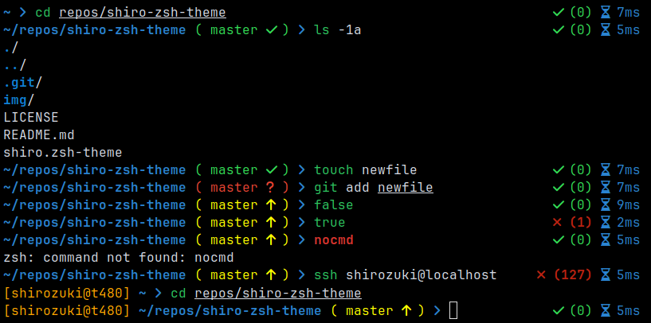

# shiro-zsh-theme: a simple, minimalistic prompt.

## Features
- Current working directory
- Exit code of last command
- Command execution time
- Git branch and status

## Requirements
This theme uses Font Awesome glyphs, so make sure it's installed on your system and your terminal is configured to use them.

## Installation
1. Download theme file: `wget https://dobrowolski.dev/download/zsh/shiro.zsh-theme`
2. Add the following line `source path-to-theme-file/shiro.zsh-theme` to `.zshrc` file
